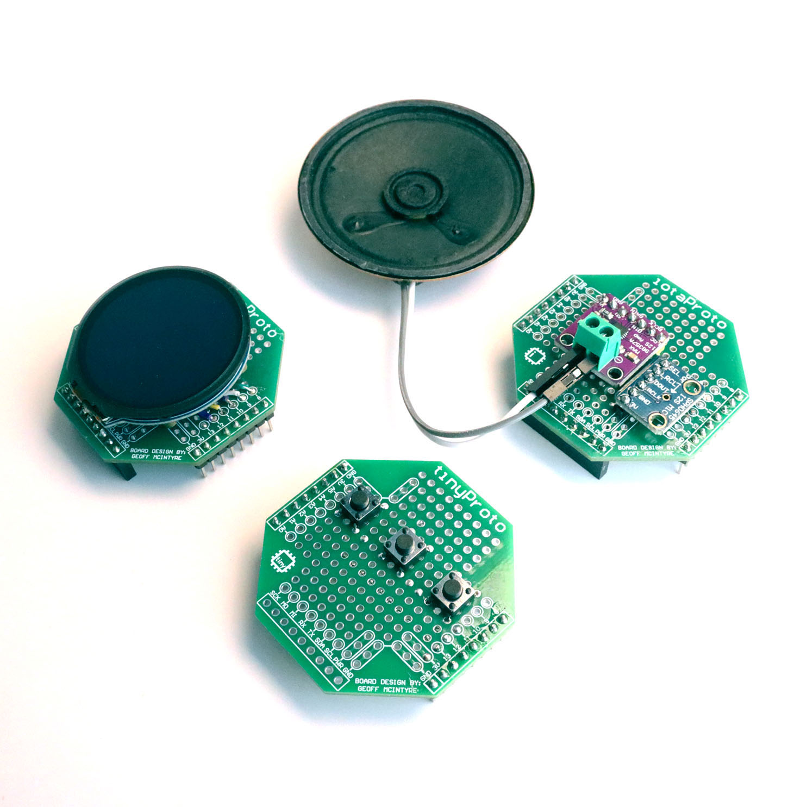

# tinyProto — Perma-protoboard HAT for tinyCore ESP32-S3

**A perma-protoboard (soldered breadboard) for the [tinyCore](https://github.com/Mister-Industries/tinyCore) ESP32-S3 platform.**

[Purchase](https://tinycore.cc/store/products/tinyproto) · [Discord](https://discord.gg/hvJZhwfQsF) · [Documentation](https://docs.mr.industries)

---

### How to open the Schematic (EasyEDA)

The tinyProto schematic is provided as an EasyEDA project file. EasyEDA is a free PCB design tool created by JLCPCB.

To open the file:
1. Go to [easyeda.com](https://easyeda.com/) and sign in (or create a free account).
2. In the editor, go to **File > Import > EasyEDA (Professional)** and select the `.epro` schematic file from the Hardware folder of this repository.
3. The full schematic will open in the editor where you can inspect the layout (PCB) and wiring (Schematic).

If you prefer to use EasyEDA's desktop application, the same import process works from the **File > Import** menu. The schematic is also viewable in the EasyEDA Pro (STD) client if you have it installed.
